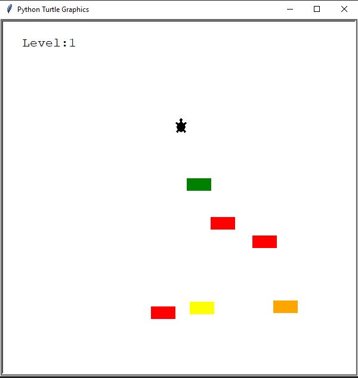
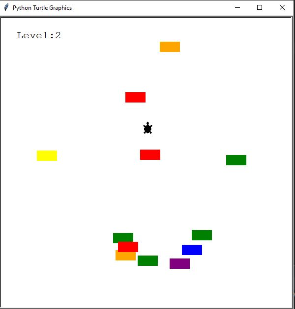

Crossing Street game foi criado a partir da biblioteca Turtle.

A partir dessa biblioteca, criei 3 classes. O placar, o jogador e o carro (ou targaruga).
O objetivo do jogo é atravessar a rua sem deixar que os carros que estão passando bata na tartaruga.

A medida em que a tartaruga consegue atravessar a rua sem que batam nela, o nível do jogo vai subindo.
Vão surgindo mais carros e eles começam a passar mais rapidamente.

