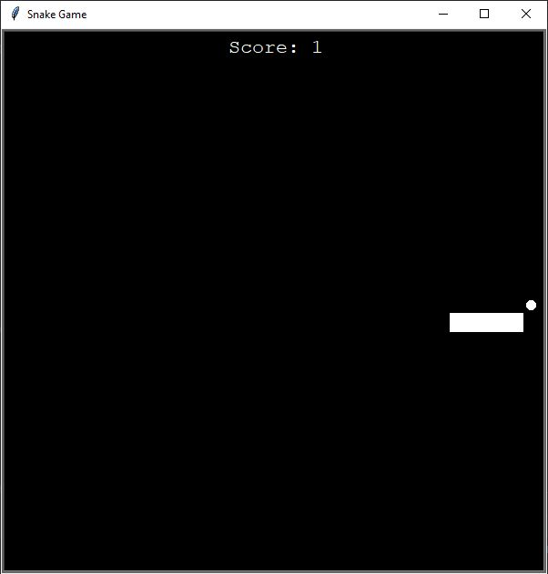

Snake game criado a partir da biblioteca Turtle.

A partir dessa biblioteca, criei 3 classes. A comida, o placar e a cobra.
A medida em que a cobra vai conseguindo pegar mais comida (os pontinhos brancos na tela), ela vai aumentando de tamanho.

Cada pontinho de comida que ela pega aumenta um ponto no placar.

Ela não pode bater nas paredes e nem no próprio corpo, caso contrário o jogo é encerrado.

