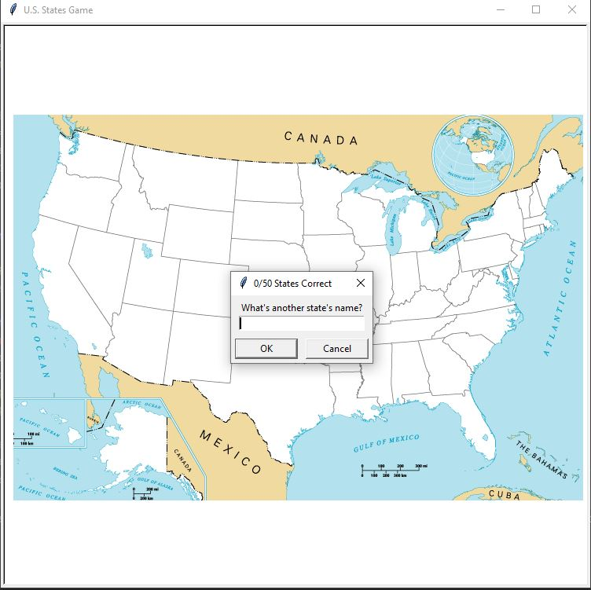
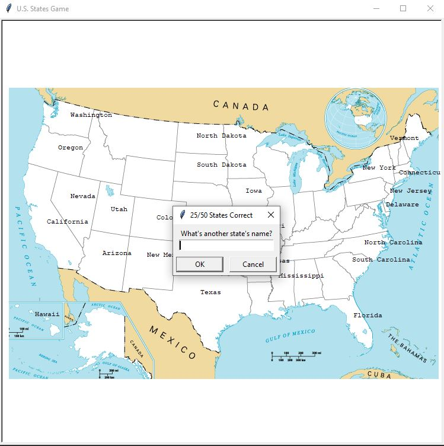

USA_States_game foi criado a partir da biblioteca Turtle. Também utilizei a biblioteca pandas para ler o arquivo resposta "50_states.csv"

A partir dessa biblioteca, criei a classe de estados no mapa, onde ele preenche o nome do estado quando o jogador acerta.
O objetivo do jogo é acertar todos os estados norte americanos. Não há limite de erros, nem tempo.

A medida em que o jogador vai acertando os estados, eles passam a aparecer no mapa e a contagem de acertos aumenta.
O jogo termina quando os 50 estados são preenchidos ou quando o jogador não sabe mais estados e digita "exit"

No final, é criado um arquivo states_to_learn.csv, onde o jogador pode verificar quais estados faltaram.

